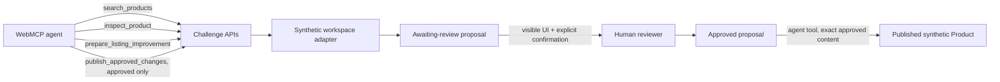

# ListingPilot Agent — WebMCP Challenge Edition

ListingPilot Agent is a small, independent WebMCP commerce copilot. A human and an agent can search a synthetic catalog, inspect explicitly classified Product Truth and Catalog Health, prepare a safe listing improvement for visible human review, and publish only the exact human-approved change to the synthetic demo catalog.

This is the **WebMCP Challenge Edition**. The commercial ListingPilot application is separate, private, and is not included or required to run this repository.

## What WebMCP adds

WebMCP lets a page register structured browser tools for an agent. This app uses the current imperative API, `document.modelContext.registerTool(...)`, and exposes exactly four tools:

| Tool | Type | Input | Result | Side effect |
|---|---|---|---|---|
| `search_products` | READ | optional bounded `query` | Product summaries | bounded audit event |
| `inspect_product` | READ | `productId` | verified/conflicting/missing facts, evidence, health | bounded audit event |
| `prepare_listing_improvement` | PREPARE | `productId`, optional `focus` | awaiting-review proposal | stores draft proposal + audit event |
| `publish_approved_changes` | WRITE | `proposalId` only | bounded publish receipt | applies the stored approved title/description to the synthetic catalog |

There is no approve tool. The publish tool cannot approve, edit, or substitute content; it fails closed unless the referenced proposal has already passed the separate human UI transition. Product and evidence content is marked as untrusted data. Tool execution calls the same same-origin APIs used by the visible app.

## Human approval model

The agent can prepare an `AWAITING_APPROVAL` proposal, but cannot transition it to `APPROVED`. Approval is a separate server-validated transition reached only from the visible human review UI. Once approved, the UI clearly waits for an agent publish action. `publish_approved_changes` can then apply only that proposal's integrity-checked stored title and description to the synthetic catalog. Duplicate calls return the original result without creating a second revision. There is no Shopify integration.



## Architecture and privacy boundary

- `src/data`: three original synthetic ecommerce Products.
- `src/domain`: challenge-only public contracts.
- `src/server`: deterministic workspace-scoped catalog, proposal state, validation, and bounded audit trail.
- `src/app/api`: same-origin server boundaries with strict Zod validation.
- `src/webmcp`: feature detection, tool contracts, registration, AbortController cleanup, and visible result events.
- `src/components`: focused human/agent collaboration UI.

The repository does **not** contain the commercial Product Truth engine, AI Detective internals, Catalog Health algorithms, generation prompts, merchant preferences, production Prisma schema, Shopify tokens/OAuth, Safe Publishing implementation, merchant data, or private source imports.

### Serverless-safe challenge state

Proposal, approval, publish, and bounded audit state is stored in a compressed, HMAC-signed, `HttpOnly` browser session cookie. Production uses `Secure`, `SameSite=None`, and `Partitioned` so the same challenge session remains available when the HTTPS site runs inside ChatGPT's embedded browser context; local development uses `SameSite=Lax`. Every tool and UI request explicitly includes credentials and disables response caching. This deliberately small challenge adapter survives Vercel serverless instance changes without a database or global in-memory singleton. The server validates every decoded field and the content fingerprint before approval or publish. Browser JavaScript cannot read the cookie; tampering fails closed. State is bounded to four proposals, three synthetic published Products, and twelve audit events. This is challenge-demo persistence, not a merchant-data architecture.

WebMCP registration is static for the document lifetime. After registering, the client checks `document.modelContext.getTools()`, retries any missing intended registration once, and reports the safe `registered/intended` count in the visible header. Session diagnostics expose only missing/valid state, proposal presence, and proposal status—never the cookie, signature, or raw payload.

## Run locally

Requirements: Node.js 20+ and npm.

```bash
npm install
npm run dev
```

Set `CHALLENGE_STATE_SECRET` in `.env.local` and in Vercel to a random value of at least 32 characters. Local development and tests have a non-production fallback; production intentionally returns a safe configuration error when the secret is absent. Open `http://localhost:3000`. The app makes no OpenAI or Shopify calls.

Quality gates:

```bash
npm test
npm run typecheck
npm run lint
npm run build
```

## Test WebMCP

### ChatGPT desktop in-app browser

1. Update the ChatGPT desktop app and ensure **Enable site tools** is on in Browser permissions.
2. Open the running app in ChatGPT’s built-in browser. A deployed HTTPS URL is preferred; `localhost` is a secure-context exception for local development.
3. Select the site-tools arrow in the address bar and confirm the four tools above appear.
4. Ask: “Search products that need improvement. Inspect the weakest result and prepare a full listing improvement.”
5. Confirm the proposal appears visibly and remains `AWAITING APPROVAL`; asking the agent to publish now must be blocked.
6. Use the visible **Approve proposal** button yourself. Confirm the UI says it is waiting for the agent.
7. Ask the agent to publish the approved proposal. Confirm the proposal becomes `PUBLISHED`, the visible catalog updates, and the audit trail records attempt and success.
8. Ask it to publish the same proposal again. Confirm the revision does not increase and the audit reports the duplicate was ignored.

### Google Chrome experimental testing

1. Use a current Chrome build supporting WebMCP testing.
2. Enable `chrome://flags/#enable-webmcp-testing` and relaunch Chrome.
3. Open the local app, use DevTools/Lighthouse to inspect registered WebMCP tools, and confirm exactly four registrations.
4. Test tool execution with Chrome’s available experimental WebMCP tooling. Browser support is experimental and may vary by build/origin-trial access.

Manual discovery has not been claimed until these steps are run in a supported browser.

## Current references

Verified on 30 August 2026:

- [WebMCP Draft Community Group Report, 26 August 2026](https://webmachinelearning.github.io/webmcp/)
- [Chrome Imperative API documentation, updated 20 August 2026](https://developer.chrome.com/docs/ai/webmcp/imperative-api)
- [OpenAI WebMCP Challenge requirements](https://openai.com/webmcp-challenge/)
- [Devpost submission requirements](https://webmcp.devpost.com/)
- [OpenAI site-tools help](https://help.openai.com/en/articles/20001423-using-site-tools-in-the-chatgpt-desktop-app)

The API is experimental. The implementation feature-detects `document.modelContext`, uses strict JSON Schema, passes execution cancellation signals to `fetch`, and unregisters all tools through one `AbortController`.

## License

MIT applies only to this challenge repository. It does not license the commercial ListingPilot product, its private repository, algorithms, data, prompts, branding beyond this demo, or merchant systems. See [NOTICE.md](NOTICE.md) and [CHALLENGE_WORK.md](CHALLENGE_WORK.md).
